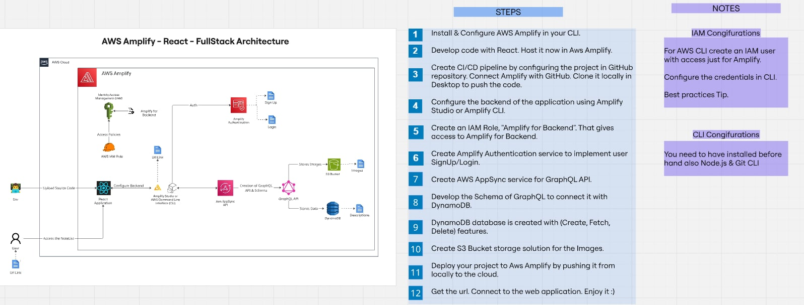
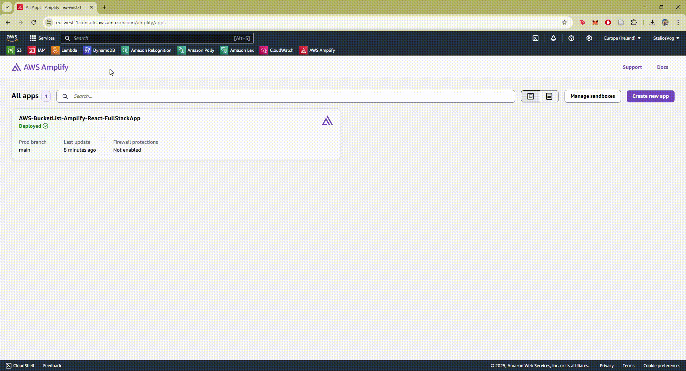

## 🎯 Note List Tracker

*Stay loosely motivated and track your notes anytime, anywhere!*    

A **React-powered** bucket list web app built with a **modern serverless architecture using AWS Amplify, AWS AppSync, AWS DynamoDB, and Amazon S3**. The app is designed with a **GraphQL API, CI/CD automation, and a fully managed cloud backend**, enabling seamless operations, authentication, and media storage. 

[🚀Live Demo](https://main.d1csowoyngmi4f.amplifyapp.com/)

### 🛠 Service Breakdown

| Service             | Purpose                                                                 |
|---------------------|-------------------------------------------------------------------------|
| AWS Amplify         | Handles backend provisioning, GraphQL API, authentication, and hosting. |
| AWS CDN Globally    | Amplify is hosting us and providing us a URL.                           |
| AWS AppSync         | GraphQL API management, supporting real-time and offline sync.          |
| AWS DynamoDB        | NoSQL database for storing structured bucket list data.                 |
| Amazon S3           | Secure, scalable object storage for images.                             |
| AWS Amplify CI/CD   | Automates deployment upon GitHub push with build and test integration.  |

---

## 📝 A Quick Look at the Web App

### 🖼️ Screenshot Preview

### 🏗️ Architecture Overview  
*With Tips and Tricks for Best Practices!*

### 🖼️ Gif Preview

---

